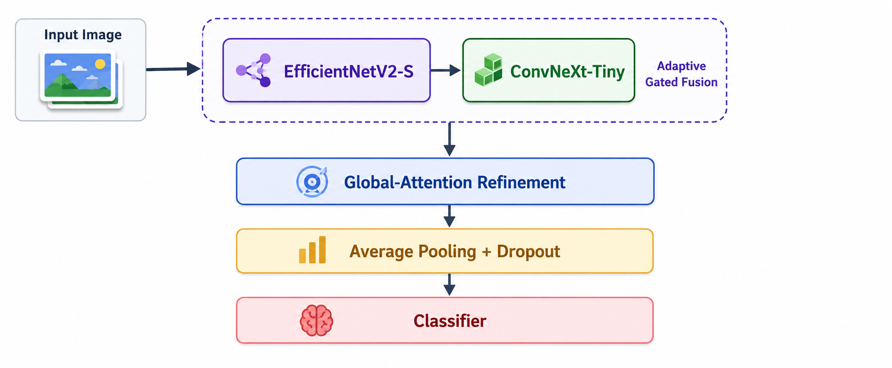

<p align="center">
  <h1 align="center">UGVNet — Unified Global Vision Network</h1>
  <p align="center">
    A hybrid dual-backbone image classifier combining<br>
    <strong>EfficientNetV2-S</strong> and <strong>ConvNeXt-Tiny</strong> with adaptive gated fusion and global self-attention.
  </p>
</p>

<p align="center">
  <a href="https://www.python.org/downloads/"></a>
  <a href="https://pytorch.org/"></a>
  <a href="#license"></a>
  
</p>

---

## Table of Contents

- [Overview](#overview)
- [Architecture](#architecture)
- [Installation](#installation)
- [Quick Start](#quick-start)
- [Python API](#python-api)
- [Dataset Preparation](#dataset-preparation)
- [Pre-Training Dataset Audit](#pre-training-dataset-audit)
- [Training Configuration](#training-configuration)
- [TensorBoard](#tensorboard)
- [Lightweight Variants](#lightweight-variants)
- [Repository Structure](#repository-structure)
- [Tests](#tests)
- [Citation](#citation)
- [Responsible Use](#responsible-use)
- [License](#license)

---

## Overview

**UGVNet** (Unified Global Vision Network) fuses spatial feature maps from two pretrained vision backbones using learned gating, then refines the combined representation with global self-attention. Designed primarily for **skin disease classification** research, but applicable to any image classification task.

### Design Rationale

| Challenge | UGVNet Solution |
|---|---|
| Fine-grained textures matter | EfficientNetV2-S captures local patterns |
| Wider spatial context needed | ConvNeXt-Tiny provides hierarchical features |
| Fixed fusion is suboptimal | Adaptive gated fusion learns per-position weights |
| Distant regions must relate | Global self-attention after convolution |
| Small medical datasets | Automatic small-dataset mode with transfer learning |

### Key Features

- **Dual-backbone fusion** — EfficientNetV2-S and ConvNeXt-Tiny (ImageNet-1K pretrained)
- **Adaptive gated fusion** — learned per-position softmax weighting between backbones
- **Global self-attention refinement** — with stochastic depth and layer scale
- **Automatic training mode** — adapts strategy based on dataset size (small vs. large)
- **Pre-training dataset audit** — scans every image for corruption, duplicates, class imbalance, and cross-split leakage
- **Discriminative learning rates** — separate backbone and fusion head LR groups
- **Backbone freeze/unfreeze** — phased warm-up with frozen backbones
- **Lightweight variants** — custom `tiny`, `small`, `base` architectures for constrained compute
- **Mixed precision training** — automatic gradient scaling on CUDA
- **Gentle auto class balancing** — effective-number sampling when imbalance is ≥ 1.5×, avoiding the extreme duplication produced by raw inverse-frequency weights
- **Class-aware augmentation** — stronger crop, RandAugment, rotation, and erasing diversity only for classes at or below half the largest class
- **Adaptive loss** — standard smoothed cross-entropy normally, with unweighted focal cross-entropy automatically selected only for severe imbalance (≥ 3×)
- **Early stopping** — configurable patience based on validation macro-F1
- **Platform notebooks** — turnkey Google Colab and Kaggle workflows with gap-aware generalization control
- **Adaptive notebook output theme** — readable light/dark tables and final accuracy cards
- **Count-annotated confusion matrices** — adaptive black/white labels in notebook and PDF output
- **Single-read dataset audit and fused CUDA optimization** — lower storage I/O and optimizer overhead
- **Full TensorBoard diagnostics** — graphs, scalars, sampled histograms, profiler traces, images, PR curves, embeddings, HParams, and hybrid-fusion internals

---

## Architecture



**Pipeline details:**

1. Both backbones are projected into a **shared channel space** (default: 384 channels) via 1×1 convolutions with GroupNorm and GELU activation.
2. Feature maps are aligned to the **same spatial resolution** via bilinear interpolation.
3. A learned **two-branch softmax gate** produces per-position weights across both branches.
4. The gated result passes through **global fusion blocks** — each containing depthwise positional encoding, multi-head self-attention, and a convolutional feed-forward network with stochastic depth and layer scale.
5. Final LayerNorm, global average pooling, dropout, and a linear classifier produce predictions.

---

## Installation

```bash
git clone https://github.com/mizanur-sajid/ugvnet.git
cd ugvnet
python -m pip install -e ".[dev,notebooks]"
```

**Requirements:**

| Dependency | Version |
|---|---|
| Python | ≥ 3.10 |
| PyTorch | ≥ 2.1 |
| torchvision | ≥ 0.16 |
| TensorBoard | ≥ 2.16 |
| TensorBoard Profiler plugin | ≥ 2.16 |
| Pillow | ≥ 10 (notebook/reporting extra) |

The `dev` extra installs pytest and Ruff; the `notebooks` extra installs the reporting and table dependencies used outside hosted notebook runtimes.

---

## Quick Start

### Notebooks

Use the notebook built for the active platform; their model, audit, training,
evaluation, reporting, and TensorBoard logic are synchronized.

| Notebook | Platform | Dataset source | Output root |
|---|---|---|---|
| [`ugvnet_colab.ipynb`](notebooks/ugvnet_colab.ipynb) | Google Colab | Mounted Google Drive path | `/content/drive/MyDrive/SkinDisNet/ugvnet` |
| [`ugvnet_kaggle.ipynb`](notebooks/ugvnet_kaggle.ipynb) | Kaggle | **Add Input**, public dataset handle, or Kaggle-local path | `/kaggle/working/ugvnet` |

Recommended execution order:

1. Enable a GPU accelerator and run Cells 01–03.
2. Configure the dataset and experiment in Cell 04.
3. Resolve and audit the complete dataset with Cells 05–08. Strict audit mode
   stops training on corruption, missing classes, or cross-split duplicates.
4. Build the data pipeline and hybrid model with Cells 09–13.
5. Run Cell 14 to open TensorBoard, then Cells 15–17 to train.
6. Run Cells 18–20 for curves, test evaluation, CSV exports, and the PDF report.
7. Refresh or rerun Cell 14 after Cell 19 so final TensorBoard plugins discover
   the evaluation data.

Both notebooks keep every completed epoch. The train–validation accuracy gap
is monitored but never rejects or rolls back work. When the gap remains above
10 percentage points for two consecutive epochs, the next epoch receives a 0.70×
learning-rate adjustment, slightly higher dropout and label smoothing, and—if
focal loss is active—a lower focal gamma. This makes the loss progressively less
focused on hard or noisy examples while normal validation macro-F1 early stopping
remains responsible for ending training.

Automatic mode uses a faster large-dataset profile at 8,000 training images:
224 px input, 256 fusion channels, one fusion block, channels-last CUDA,
prefetched loaders, mixed precision, and GPU-side metric accumulation. The full
EfficientNetV2-S + ConvNeXt-Tiny backbone pair remains unchanged.

### CLI Training

```bash
# Hybrid model (recommended)
python scripts/train_hybrid.py --data-dir /path/to/dataset

# Lightweight model
python scripts/train_lightweight.py --data-dir /path/to/dataset --variant tiny

# Full options example
python scripts/train_hybrid.py \
  --data-dir /path/to/dataset \
  --training-mode auto \
  --image-size 300 \
  --batch-size 16 \
  --fusion-channels 384 \
  --attention-heads 8 \
  --fusion-depth 2 \
  --epochs 60 \
  --seed 42 \
  --run-name my_experiment
```

### Standalone Dataset Audit

Run the audit independently without starting training:

```bash
python scripts/audit_dataset.py --data-dir /path/to/dataset --policy strict
```

---

## Python API

### Basic Usage

```python
import torch
from ugvnet.hybrid import ugvnet_hybrid

model = ugvnet_hybrid(num_classes=7, pretrained=True)

images = torch.randn(4, 3, 300, 300)
logits = model(images)  # → torch.Size([4, 7])
```

### Phased Training with Backbone Freeze/Unfreeze

```python
# Phase 1: freeze backbones, train fusion head first
model.set_backbones_trainable(False)
# ... train ...

# Phase 2: unfreeze backbones with lower learning rate
model.set_backbones_trainable(True)
# ... train with discriminative LRs ...
```

### Discriminative Learning Rates

```python
optimizer = torch.optim.AdamW([
    {"params": model.backbone_parameters(), "lr": 3e-5},
    {"params": model.new_parameters(), "lr": 3e-4},
], weight_decay=0.05)
```

### Inspect Fusion Weights

```python
features, fusion_weights = model.forward_features(images, return_fusion_weights=True)
# fusion_weights.shape → (batch, 2, H, W)
# Each position sums to 1.0 across the two backbone branches
```

### Embedding Mode (No Classifier)

```python
model = ugvnet_hybrid(num_classes=0, pretrained=True)
embeddings = model(images)  # → torch.Size([4, 384])
```

### Constructor Parameters

| Parameter | Type | Default | Description |
|---|---|---|---|
| `num_classes` | int | (required) | Number of output classes. Set to 0 for embeddings. |
| `pretrained` | bool | `True` | Load ImageNet-1K backbone weights |
| `fusion_channels` | int | `384` | Width of the shared feature space |
| `attention_heads` | int | `8` | Number of global-attention heads |
| `fusion_depth` | int | `2` | Number of global fusion-refinement blocks |
| `dropout` | float | `0.2` | Dropout rate for fusion blocks and classifier |
| `attention_dropout` | float | `0.0` | Dropout within attention layers |
| `drop_path_rate` | float | `0.1` | Maximum stochastic depth rate |

---

## Dataset Preparation

Expects an **ImageFolder** layout with three splits:

```text
dataset/
├── train/<class_name>/
├── validation/<class_name>/
└── test/<class_name>/
```

The same class folders must appear in **all three splits**. Class names are derived from folder names and must match exactly.

> **Warning:** Images from the same patient, session, or augmented source must stay in **only one split** to prevent data leakage.

---

## Pre-Training Dataset Audit

UGVNet includes a comprehensive dataset integrity scanner that runs automatically before training begins. It decodes and hashes every image using multi-threaded workers to detect:

- **Corrupt or unreadable images** — files that fail to decode via PIL
- **Exact duplicates** — both within-split and cross-split (data leakage)
- **Class imbalance** — measured as max/min class count ratio
- **Missing or empty class folders** — across train, validation, and test
- **Inconsistent class names** — class folders that differ between splits

The audit produces a detailed JSON report (`dataset_audit.json`) with per-split class counts, image dimension statistics, format distributions, color mode breakdowns, and actionable recommendations. Supported image formats: JPEG, PNG, BMP, TIFF, WebP, and GIF.

### Audit Policies

| Policy | Behavior |
|---|---|
| `strict` | Block training on any critical issue (default) |
| `warn` | Log issues and continue with risk acceptance |
| `off` | Skip the audit entirely (not recommended) |

### Standalone Audit

```bash
python scripts/audit_dataset.py \
  --data-dir /path/to/dataset \
  --policy strict \
  --workers 8 \
  --report results/dataset_audit.json
```

### Programmatic Audit

```python
from ugvnet import audit_dataset, enforce_audit_policy

report = audit_dataset("/path/to/dataset", report_path="audit.json")
enforce_audit_policy(report, policy="strict")
```

---

## Training Configuration

### Automatic Small/Large Dataset Mode

The CLI training script uses **20,000 training images** as the automatic boundary between small and large modes. The notebooks use a lower threshold of **8,000 training images**.

| Setting | Small (< threshold) | Large (≥ threshold) |
|---|---|---|
| **Input resolution** | 300 px | 224 px |
| **Fusion profile** | 384 channels / 2 blocks | 256 channels / 1 block (notebooks only) |
| **Backbone freeze** | 5 warm-up epochs | 0 epochs (CLI) / 2 epochs (notebooks) |
| **Augmentation** | Stronger crops (60–100%), RandAugment magnitude 7 | Less aggressive crops (75–100%), magnitude 5 |
| **Random erasing** | p = 0.20 | p = 0.10 |

Override with `--training-mode small` or `--training-mode large`.

### Shared Training Features

Both modes include:

- **Auto class balancing** — effective-number weighted sampling when class imbalance ratio ≥ 1.5×; set `BALANCED_SAMPLER_STRATEGY="inverse_frequency"` only when full inverse weighting is explicitly desired
- **Minority augmentation** — automatic stronger augmentation for clearly underrepresented classes without adding extra transforms to every image
- **Loss auto-selection** — smoothed cross-entropy by default and focal loss for severe imbalance, without stacking class weights in both sampler and loss
- **Early stopping** — patience of 12 epochs based on validation macro-F1 (hybrid) or best validation accuracy (lightweight)
- **Mixed precision** — automatic on CUDA devices (disable with `--no-amp`)
- **Gradient clipping** — max norm 1.0
- **Cosine annealing** — LR schedule over total epochs
- **Label smoothing** — 0.1 by default
- **Reproducibility** — seeded RNG for Python, PyTorch, and CUDA

### CLI Arguments Reference (Hybrid)

| Argument | Default | Description |
|---|---|---|
| `--data-dir` | (required) | Path to ImageFolder dataset |
| `--image-size` | 300 | Input resolution |
| `--epochs` | 60 | Maximum training epochs |
| `--batch-size` | 16 | Images per batch |
| `--fusion-learning-rate` | 3e-4 | LR for fusion head and classifier |
| `--backbone-learning-rate` | 3e-5 | LR for pretrained backbones |
| `--weight-decay` | 0.05 | AdamW weight decay |
| `--label-smoothing` | 0.1 | Cross-entropy label smoothing |
| `--dropout` | 0.2 | Dropout rate |
| `--fusion-channels` | 384 | Shared feature space width |
| `--fusion-depth` | 2 | Number of fusion blocks |
| `--attention-heads` | 8 | Multi-head attention heads |
| `--training-mode` | auto | `auto`, `small`, or `large` |
| `--freeze-backbone-epochs` | auto | Epochs with frozen backbones (5 small / 0 large) |
| `--class-balance` | auto | `auto`, `on`, or `off` |
| `--pretrained` / `--no-pretrained` | on | Use ImageNet-1K weights |
| `--amp` / `--no-amp` | on | Mixed precision training |
| `--patience` | 12 | Early stopping patience |
| `--gradient-clip` | 1.0 | Max gradient norm |
| `--audit-policy` | strict | `strict`, `warn`, or `off` |
| `--audit-workers` | auto | Image-scanning workers (0 = auto-detect) |
| `--seed` | 42 | Random seed |
| `--run-name` | ugvnet_hybrid | Experiment identifier |
| `--device` | auto | `auto`, `cuda`, or `cpu` |
| `--tensorboard` / `--no-tensorboard` | on | Enable TensorBoard diagnostics |
| `--tensorboard-dir` | tensorboard | Root for timestamped event logs |
| `--tensorboard-histogram-interval` | 5 | Selected parameter/gradient histogram interval; 0 disables |
| `--tensorboard-profile-batches` | 5 | First-epoch batches captured by the profiler; 0 disables |

### CLI Arguments Reference (Lightweight)

| Argument | Default | Description |
|---|---|---|
| `--data-dir` | (required) | Path to ImageFolder dataset |
| `--variant` | tiny | `tiny`, `small`, or `base` |
| `--image-size` | 224 | Input resolution |
| `--epochs` | 100 | Maximum training epochs |
| `--batch-size` | 32 | Images per batch |
| `--learning-rate` | 3e-4 | Learning rate |
| `--weight-decay` | 0.05 | AdamW weight decay |
| `--label-smoothing` | 0.1 | Cross-entropy label smoothing |
| `--dropout` | 0.1 | Dropout rate |
| `--audit-policy` | strict | `strict`, `warn`, or `off` |
| `--audit-workers` | auto | Image-scanning workers (0 = auto-detect) |
| `--seed` | 42 | Random seed |
| `--run-name` | ugvnet_lightweight | Experiment identifier |
| `--device` | auto | `auto`, `cuda`, or `cpu` |
| `--tensorboard` / `--no-tensorboard` | on | Enable TensorBoard diagnostics |
| `--tensorboard-dir` | tensorboard | Root for timestamped event logs |
| `--tensorboard-histogram-interval` | 5 | Selected parameter histogram interval; 0 disables |

### Troubleshooting Out-of-Memory

If you encounter CUDA OOM errors, try these steps in order:

1. Reduce batch size: `--batch-size 8`
2. Reduce input resolution: `--image-size 224`
3. Reduce fusion channels: `--fusion-channels 256`
4. Disable mixed precision if it causes issues: `--no-amp`

### Output Artifacts

Notebook artifacts are separated by platform. Colab persists them in Google
Drive; Kaggle keeps them in `/kaggle/working/ugvnet` for download or inclusion
in a saved notebook version.

| Artifact | Colab path under project root | Kaggle path under output root |
|---|---|---|
| Best model | `models/best/colab/ugvnet_hybrid_best.pt` | `models/best/ugvnet_hybrid_best.pt` |
| Last checkpoint | `models/checkpoints/colab/ugvnet_hybrid_last.pt` | `models/checkpoints/ugvnet_hybrid_last.pt` |
| Audit, metrics, CSV, JSON, and plots | `results/colab/` | `results/` |
| Timestamped PDF and manifest | `reports/colab/` | `reports/` |
| TensorBoard events | `tensorboard/colab/<run_name>/` | `tensorboard/<run_name>/` |

The final notebook summary reports **Best Training Accuracy**, **Best Validation
Accuracy**, and **Best Test Accuracy** in percentages and decimal form. The PDF
contains the training configuration, dataset audit, epoch/adaptation history,
curves, complete class metrics, numbered confusion matrix, class-wise error rates,
the most frequent true/predicted confusion pairs, and the same accuracy summary.

CLI runs use the configured `--results-dir`, `--models-dir`, and
`--tensorboard-dir`, with `--run-name` used to isolate experiments.

---


### Imbalance controls and exact resume

The notebook settings are dataset-aware:

- `BALANCED_SAMPLER_STRATEGY = "effective_number"` uses a dataset-sized automatic
  beta and produces gentler weights than inverse frequency.
- `MINORITY_AUGMENTATION = "auto"` applies the stronger transform only when the
  dataset is imbalanced and a class contains at most
  `MINORITY_AUGMENTATION_MAX_FRACTION` of the largest class.
- `LOSS_FUNCTION = "auto"` enables focal loss only when the imbalance reaches
  `FOCAL_LOSS_IMBALANCE_THRESHOLD`; it never adds another class-weight vector on
  top of the balanced sampler.
- `RESUME_CHECKPOINT_PATH` restores model, optimizer, scheduler, AMP scaler,
  epoch/adaptation history, early-stopping state, adaptive dropout and label
  smoothing, backbone freeze state, and Python/NumPy/PyTorch random states. Use
  only a checkpoint created by this project.

Cell 19 writes `test_class_error_analysis.csv` and
`test_confusion_pairs.csv`. Both tables are included in the final PDF, while the
largest confusion pairs and per-class error rates are also sent to TensorBoard.

## TensorBoard

TensorBoard is enabled by default in both notebooks and CLI trainers. The two
platform notebooks provide the complete diagnostic suite described below; CLI
trainers retain the lighter graph, scalar, histogram, profiler, PR, Projector,
and HParams workflow. Expensive notebook diagnostics are sampled so they remain
practical on large datasets.

| When data appears | Dashboards and content |
|---|---|
| Model setup (Cell 13) | Text configuration, parameter counts, audit scalars, a promoted expandable operation graph, a high-resolution full architecture map with real stage shapes and parameter counts, and an initial selected-parameter histogram snapshot |
| Training (Cell 17) | Loss, accuracy, macro-F1, class precision/recall/specificity/ROC-AUC, calibration error, learning rates, throughput, gradient norm, non-blocking gap warnings and regularization adaptations, runtime dropout/label-smoothing/focal-gamma state, hybrid diagnostics, CPU/RAM/disk/GPU telemetry, and the five-batch profiler trace |
| Epoch 1 and every 5 completed epochs | Selected activation distributions, AdamW moment distributions, and sampled validation embeddings showing representation evolution |
| Test evaluation (Cell 19) | Numbered confusion matrix, class-wise error ranking, top true/predicted confusion pairs, predictions, fusion heatmaps, PR and ROC curves, reliability diagram, fused-feature Grad-CAM, final embeddings, HParams, complete class metrics, and artifact paths |

The Graphs dashboard promotes the normally collapsed `UGVNetHybrid` root into named EfficientNetV2-S, ConvNeXt-Tiny, adaptive-fusion, global-refinement, normalization, pooling, dropout, and classifier sections. Expand a section to inspect its complete traced operation graph. The Images dashboard also contains `Model/full_architecture`, a readable end-to-end map with executed stage shapes and parameter counts; the same figure is saved as `results/ugvnet_full_architecture.png`.

Hybrid diagnostics include the EfficientNetV2-S and ConvNeXt-Tiny gate weights,
gate entropy and dominance, branch-selection rate, projected feature norms,
branch cosine similarity, fused-feature norms, and global-attention entropy.
System telemetry includes process RAM, host RAM pressure, CPU load, disk usage and
process I/O, PyTorch CUDA allocation/reservation/peak memory, and—when
`nvidia-smi` is available—GPU utilization, device memory, temperature, and power.

Colab logs persist at
`/content/drive/MyDrive/SkinDisNet/ugvnet/tensorboard/colab`. Kaggle logs remain
at `/kaggle/working/ugvnet/tensorboard`. Open Cell 14 before Cell 17 for live
monitoring, then refresh or rerun it after Cell 19. The Profiler plugin is
installed on a best-effort basis; an offline runtime continues training and
writes the raw trace even if the Profiler UI cannot be installed.

Existing event files cannot acquire new dashboards retroactively. Select the
new timestamped run after executing the updated notebook. If a tab is inactive,
confirm that its producing stage in the table above has completed.

For CLI training, start TensorBoard in a second terminal:

```bash
tensorboard --logdir tensorboard --port 6006
```

Use `--no-tensorboard` to disable CLI logging. In notebook Cell 04, individual
switches control activations, optimizer state, class metrics, telemetry,
embeddings, ROC, calibration, Grad-CAM, images, and profiler capture. Exhaustive
dual-backbone histograms are implemented but disabled by default because they can
substantially increase logging time and event-file size. Audio and Mesh remain
excluded because UGVNet produces neither type of data.

---

## Lightweight Variants

Custom from-scratch architectures for constrained compute environments (no pretrained backbones):

```python
from ugvnet import ugvnet_tiny, ugvnet_small, ugvnet_base, create_ugvnet

model = ugvnet_tiny(num_classes=7)
model = create_ugvnet("small", num_classes=7, dropout=0.2)
```

### Variant Specifications

| Variant | Stage Widths | Stage Depths | Attention Heads | Drop Path |
|---|---|---|---|---|
| `tiny` | 32 → 48 → 96 → 192 → 320 | 1-2-2-2 | 6, 10 | 0.10 |
| `small` | 32 → 64 → 128 → 256 → 384 | 2-2-4-3 | 8, 12 | 0.20 |
| `base` | 48 → 96 → 192 → 384 → 512 | 2-3-6-4 | 12, 16 | 0.30 |

### Lightweight Architecture

Each lightweight variant follows a 4-stage hierarchical design:

- **Stages 1–2 (Local):** MBConv inverted residual blocks with squeeze-excite attention for efficient local feature extraction.
- **Stages 3–4 (Global):** UGV blocks combining depthwise-convolutional local mixing, global multi-head self-attention, and convolutional feed-forward networks with stochastic depth and layer scale.

All stages use a stride-2 downsample, producing feature maps at strides 4, 8, 16, and 32 relative to the input.

### Additional API

```python
# Backbone / embedding mode (no classifier)
model = create_ugvnet("tiny", num_classes=0)
embeddings = model(images)  # → torch.Size([batch, 320])

# Replace classifier for transfer learning
model.reset_classifier(num_classes=10)

# Access intermediate feature maps at strides 4, 8, 16, 32
features = model.forward_intermediates(images)

# Custom input channels (e.g., grayscale)
model = ugvnet_tiny(num_classes=7, in_channels=1)
```

> **Note:** The hybrid model is strongly preferred for accuracy. Use lightweight variants only when pretrained backbones are unavailable or compute is severely limited.

---

## Repository Structure

```text
ugvnet/
├── assets/
│   └── architecture.png        # Architecture overview
├── notebooks/
│   ├── ugvnet_colab.ipynb      # Drive-oriented Colab workflow
│   ├── ugvnet_kaggle.ipynb     # Kaggle-oriented workflow
│   └── README.md               # Notebook behavior and storage notes
├── scripts/
│   ├── audit_dataset.py        # Standalone full-dataset audit
│   ├── train_hybrid.py         # Recommended hybrid CLI trainer
│   └── train_lightweight.py    # Lightweight CLI trainer
├── src/ugvnet/
│   ├── __init__.py             # Public API
│   ├── data_audit.py           # Integrity and leakage scanner
│   ├── hybrid.py               # EfficientNetV2-S + ConvNeXt-Tiny model
│   └── lightweight.py          # Tiny, small, and base variants
├── tests/                      # pytest suite
├── models/                     # Best and resumable checkpoints
├── results/                    # Audits, metrics, CSV/JSON, and plots
├── reports/                    # Timestamped PDF reports and manifests
├── tensorboard/                # Event logs and TensorBoard usage notes
├── pyproject.toml              # Package metadata and dependencies
├── LICENSE
└── README.md
```

Generated checkpoints, caches, results, reports, and event files are ignored by
Git. Small README and `.gitkeep` files retain the professional directory layout
in a fresh clone. Kaggle does not create redundant `kaggle/` subfolders in the
Drive project.

---

## Tests

```bash
python -m pytest
```

The test suite validates:

- **Hybrid model** — output shapes, fusion weight probability distribution (sums to 1.0), backbone freeze/unfreeze behavior
- **Lightweight model** — output shapes across variants, resolution flexibility, intermediate feature map dimensions, classifier reset, custom input channels, unknown variant rejection
- **Dataset audit** — corrupt image detection, cross-split duplicate/leakage detection, strict policy enforcement, clean dataset pass-through

Tests use small tensor sizes and `pretrained=False` for fast CPU-only execution.

---

## Citation

```bibtex
@software{ugvnet2026,
  author       = {Sajid, Mizanur Rahman},
  title        = {{UGVNet}: Unified Global Vision Network for Skin Disease Classification},
  year         = {2026},
  url          = {https://github.com/mizanur-sajid/ugvnet},
  note         = {Hybrid dual-backbone CNN-attention model combining EfficientNetV2-S
                  and ConvNeXt-Tiny with adaptive gated fusion}
}
```

---

## Responsible Use

> **Disclaimer:** UGVNet is **research software**. Predictions are **not a medical diagnosis** and must not replace assessment by a qualified healthcare professional. Always validate on your specific population and imaging conditions before any clinical application.

---

## License

**MIT License** — Copyright (c) 2026 Mizanur Rahman Sajid. See [LICENSE](LICENSE) for full terms.

---

<p align="center">
  Built by <strong>Mizanur Rahman</strong> for the dermatology and medical imaging research community.
</p>
